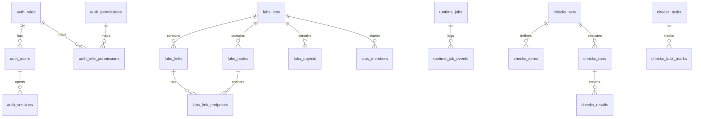

# DB v3 Proposal (Simplified Domains)

This is a clean prototype schema in a separate database (`eve-ng-db-v3`) for manual review.

## Why this version is simpler
- Domain split by schema: `auth`, `infra`, `labs`, `runtime`, `checks`, `ops`.
- Foreign keys are mostly inside one domain.
- Cross-domain references are plain UUID fields when strict coupling is not required.
- Support views in `ops` reduce manual JOIN complexity.

## Domain map
- `auth`: users, roles, permissions, sessions.
- `infra`: clouds and cloud access policy.
- `labs`: topology only (labs, nodes, links, endpoints, objects).
- `runtime`: workers, jobs, node runtime states, queue settings.
- `checks`: lab checks, runs/results, tasks/task marks.
- `ops`: read-only support views.

## Main design decisions
- No hard FK from `labs` to `auth.users`.
- No hard FK from `runtime` to `labs`.
- `checks` tied to check-set lifecycle, but keeps `lab_id` as UUID for decoupling.
- Topology model is linear:
  - `labs.links`
  - `labs.link_endpoints`
  This replaces many indirect topology links.

## Quick ER sketch


## Deploy
```bash
cd /opt/unetlab/eve-web
./bin/create_v3_db.sh
```

Optional override:
```bash
V3_DB_NAME=eve-ng-db-v3 ./bin/create_v3_db.sh
```

## Inspect
```bash
PGPASSWORD='<db_password>' psql "host=127.0.0.1 port=5432 dbname=eve-ng-db-v3 user=eve-ng-ktk"
\dn
\dt auth.*
\dt labs.*
\dt runtime.*
\dt checks.*
\dv ops.*
```
